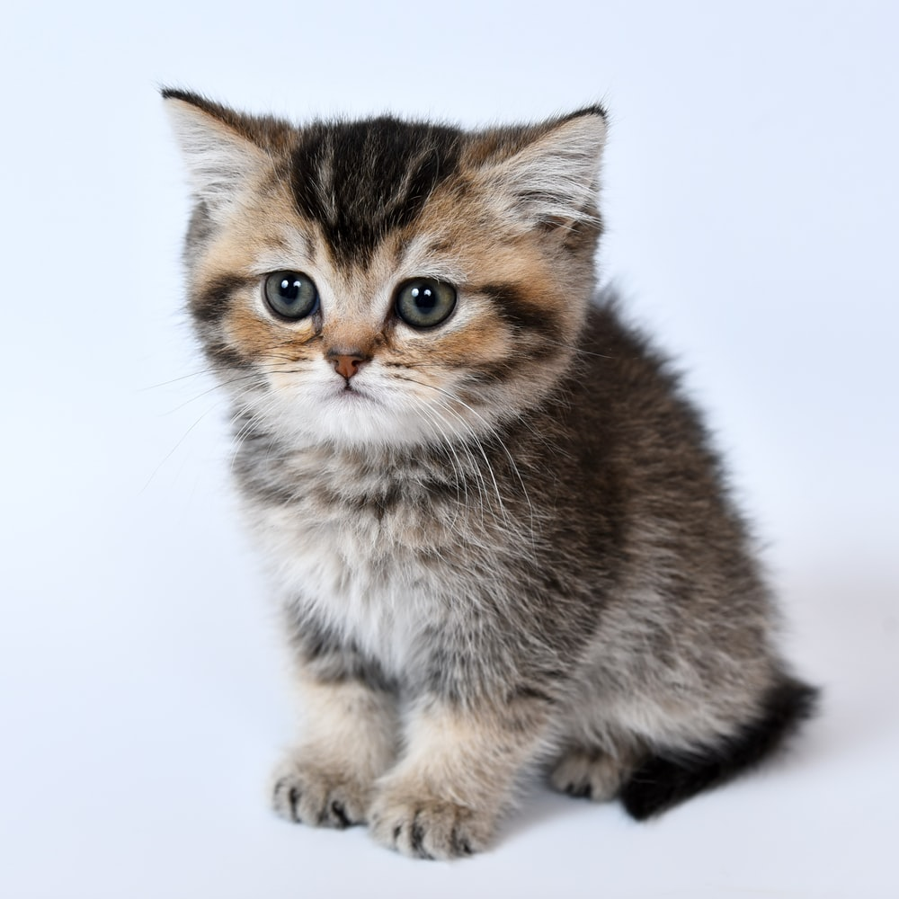
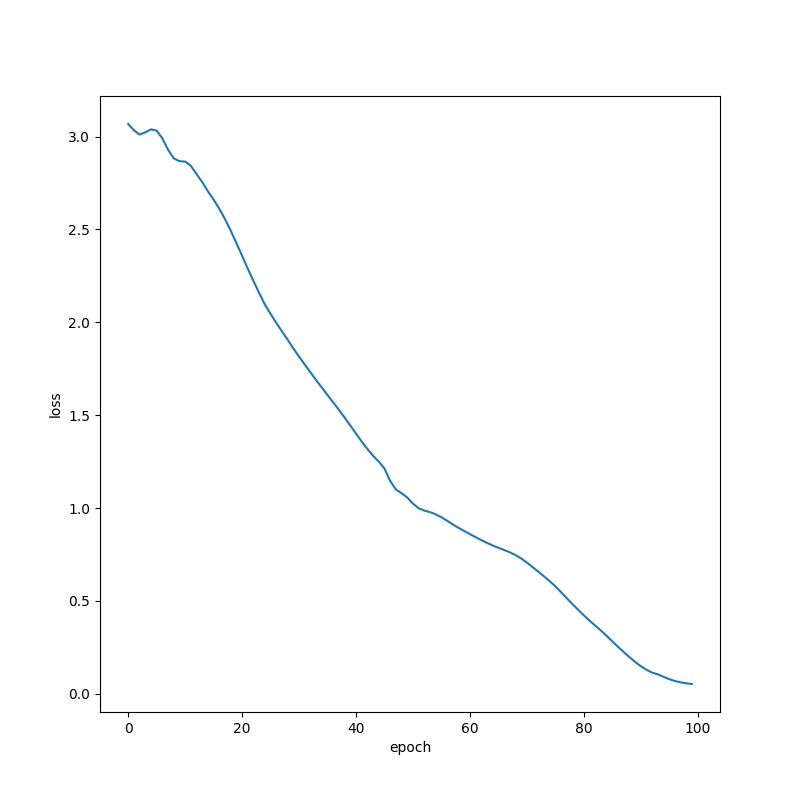

# autodiff



This is a smöl implementation of reverse-mode automatic differentiation.

`x = Var(i, param=True)` creates a `Var` instance, where `param=True` means calling `Var.backward` will compute the derivative of the objective (or loss) w.r.t `x`.

```
x = Var(3, param=True)
y = x ** 2 + math.e ** x
y.backward()
print(x.grad)
```

...returns the derivative of `y` w.r.t `x`. The `grad` decorator in `autodiff.py` returns the derivative (or tuple of derivatives) directly.

```
def f(x):
  return x ** 2 + math.e ** x
  
gradf = grad(f)

print(*gradf(3))  # prints df/dx evaluated @ x = 3
```

`autonn.py` implements a neural net using `autodiff.py` in `test.py`. Very simple to train, but very slow since it doesn't use NumPy. Who needs matrices when you got RMAD?

<p align="center"></img></p>
